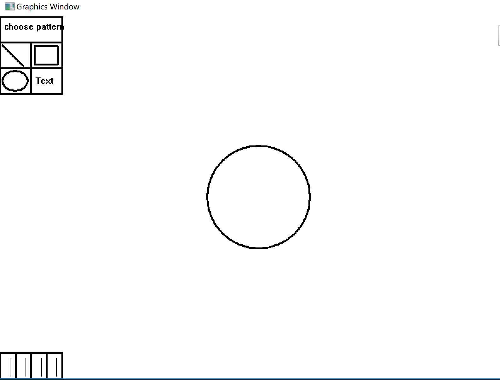
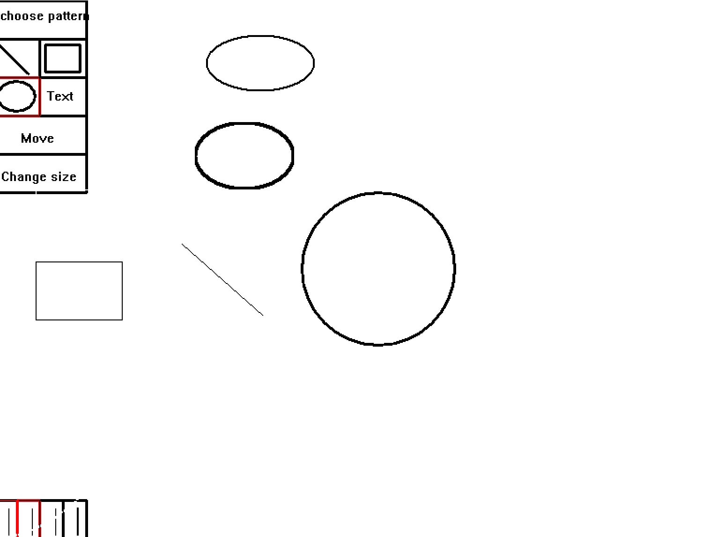

run igp.exe 

select one figure and draw

If you want to delete a figure, first press "delete" on keyboard and then select the figure, then you will successfully delete the figure

If you want to change the size of a figure, first select the figure and then click "Change size" in the menu.
Then you can drag the handle to change the size of the figure. 

If you want to move the figure, first select the figure and then click "move" in the menu, then you can move it!

